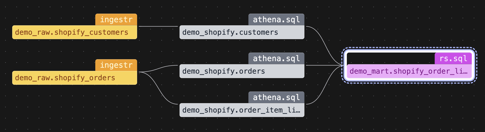

# Bruin - Multi-engine Shopify Pipeline with Athena and Redshift

This is an example of a multi-engine pipeline built with [Bruin](https://github.com/bruin-data/bruin), running on [Athena](https://github.com/bruin-data/bruin/tree/main/platforms/athena) and [Redshift](https://github.com/bruin-data/bruin/tree/main/platforms/redshift) using [Apache Iceberg](https://iceberg.apache.org/).



The pipeline is rather simple:
- Ingest customer and order data from Shopify into S3 using Iceberg, Glue & Athena
- Build core entities using Athena
- Build a simple mart using Redshift

The resulting assets in this pipeline are all queryable from both Athena and Redshift, and all stored in S3 in Iceberg format. 

## Prerequisites
- Install [Bruin CLI](https://bruin-data.github.io/bruin/getting-started/introduction/installation.html)
- Make sure you have a valid AWS account with access to Athena, Glue, Redshift and S3

For the purpose of this Demo the Redshift cluster is [publicly accessible](https://bruin-data.github.io/bruin/platforms/redshift.html#making-redshift-publicly-accessible), feel free to connect to your cluster in any way you want.

## Set up Glue & Redshift
While Athena has a rather seamless integration with Glue, Redshift is a bit more work. In order to use Iceberg tables with Redshift, you need to create external schemas in Redshift that reference the Iceberg tables in S3.

In this demo, we have 3 schemas, define them in your Redshift cluster:

```sql
create external schema demo_raw
from data catalog
database 'demo_raw'
region '<your-aws-region>'
iam_role '<your-role-arn-here>';

create external schema demo_shopify
from data catalog
database 'demo_shopify'
region '<your-aws-region>'
iam_role '<your-role-arn-here>';

create external schema demo_mart
from data catalog
database 'demo_mart'
region '<your-aws-region>'
iam_role '<your-role-arn-here>';
```

The role ARN needs to be the role that has access to the S3 bucket where the Iceberg tables are stored, as well as Glue.

## Set up Bruin credentials

Run the following command to set up your Bruin credentials:
```
bruin validate
```

This will create an empty `.bruin.yml` file in the root of the project.

Fill it with the following credentials:
```yaml
default_environment: default
environments:
    default:
        connections:
            athena:
                - name: athena-default
                  access_key_id: <your-access-key-id>
                  secret_access_key: <your-secret-access-key>
                  query_results_path: s3://<your-query-results-path>
                  region: <your-aws-region>
            redshift:
                - name: redshift-default
                  username: <your-redshift-username>
                  password: <your-redshift-password>
                  host: <your-redshift-host>
                  port: <your-redshift-port>
                  database: <your-redshift-database>
                  pool_max_conns: <your-redshift-pool-max-conns>
            shopify:
                - name: shopify-default
                  url: <your-shopify-url>
                  api_key: <your-shopify-api-key>
```

If you need credentials for Shopify, you can simply [create a development store](https://help.shopify.com/en/partners/dashboard/managing-stores/development-stores) in Shopify and use the credentials to pull the data.

## Running the pipeline

You can run the pipeline by running the following command in the project root:

```shell
bruin run --start-date 2010-01-17T00:00:00.000Z --end-date 2025-03-17T23:59:59.999999999Z ./demo-pipeline
```

This will run the pipeline to get all the historical data from Shopify, and build all the tables in Athena and Redshift.

# So what?

This pipeline is a demo of the kinds of multi-engine pipelines that can be built with [Bruin](https://github.com/bruin-data/bruin).

Bruin enables you to build pipelines that can run on different engines, and even different cloud providers. You can use the right tool for the job, and make the most of your data while building cost-effective solutions.

Some other things you can do with Bruin:
- You can pull data from a [wide variety of sources](https://bruin-data.github.io/bruin/ingestion/overview.html), not just Shopify.
- You can run stuff on Athena, Redshift, BigQuery, Snowflake, and more, in the same pipeline.
- You can run Python within the same pipeline, use PyIceberg to read and write Iceberg tables.
- You can run some parts of your pipeline in cheaper engines, and only run the crucial parts in more powerful engines.

The possibilities are endless!

[Hit us up](https://getbruin.com) if these sound interesting to you.